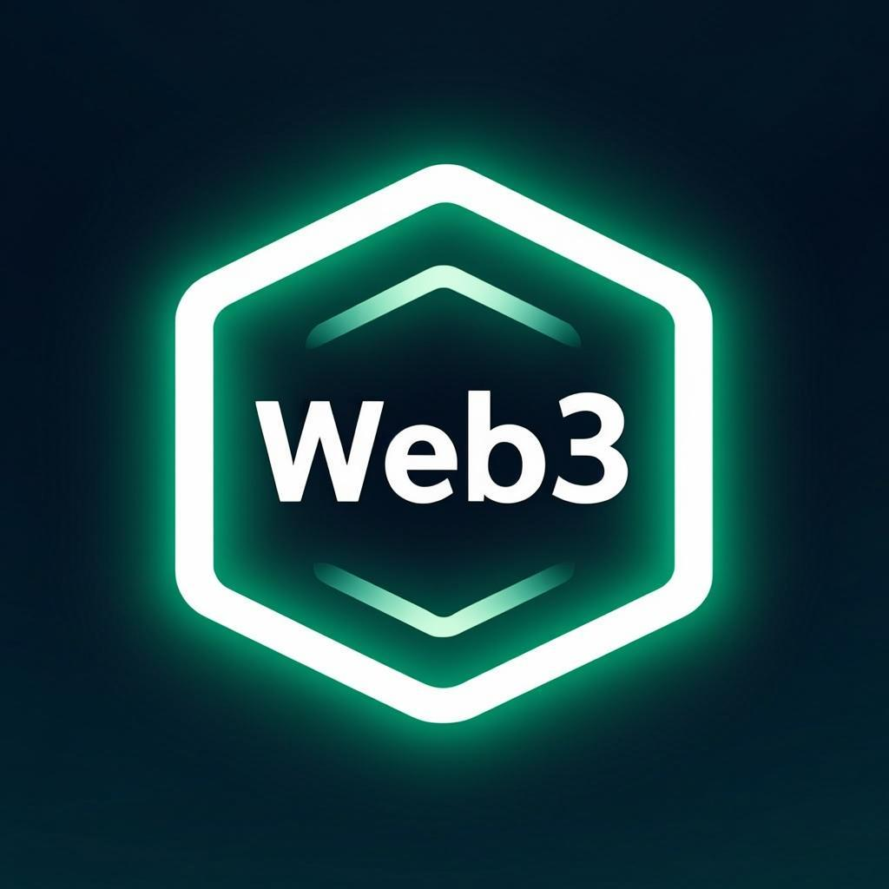

# Atlas Core Banking — Centro de Comando Web3

<p align="center">
  
  <br />
  <strong>Plataforma Institucional Web3</strong>
  <br />
  Gestão de wallets multi-moeda · Settlement automatizado · Operações cross-border
  <br /><br />
  
  
  
  
  
  
  
</p>

---

## Índice

- [Sobre](#sobre)
- [Arquitetura](#arquitetura)
- [Stack Tecnológico](#stack-tecnológico)
- [Estrutura do Projeto](#estrutura-do-projeto)
- [Funcionalidades](#funcionalidades)
- [Páginas do Dashboard](#páginas-do-dashboard)
- [Modelo RBAC](#modelo-rbac)
- [API Backend](#api-backend)
- [Variáveis de Ambiente](#variáveis-de-ambiente)
- [Instalação & Desenvolvimento](#instalação--desenvolvimento)
- [Deploy](#deploy)
- [KYC & Tiers](#kyc--tiers)
- [Integrações](#integrações)
- [Roadmap](#roadmap)

---

## Sobre

O **Atlas Core** é uma plataforma de Core Banking institucional Web3 construída com Next.js 16 (App Router). Oferece gestão centralizada de wallets multi-moeda (EUR, BRL, USD, USDT), motor de swap com taxas reais, settlement automatizado, KYC progressivo em 4 níveis, e ferramentas para merchants (Payment Links, API Keys, Checkouts).

A plataforma funciona como **SPA (Single Page Application)** com routing via Zustand — toda a navegação é gerida client-side com base no estado de autenticação e permissões RBAC.

**Versão atual:** 2.0.0
**Status:** Em desenvolvimento ativo
**Domínio:** atlascore.io

---

## Arquitetura

```
┌─────────────────────────────────────────────────────────┐
│                    Atlas Core Frontend                   │
│                  (Next.js 16 App Router)                 │
│                                                          │
│  ┌─────────────┐  ┌──────────────┐  ┌────────────────┐  │
│  │  Landing /   │  │  Dashboard   │  │  Admin Panel   │  │
│  │  Login Page  │  │  (14 pages)  │  │  (4 pages)     │  │
│  └──────┬───────┘  └──────┬───────┘  └───────┬────────┘  │
│         │                 │                   │           │
│  ┌──────┴─────────────────┴───────────────────┴────────┐  │
│  │              Zustand State Management                │  │
│  │   (auth-store · nav-store · baas-store)             │  │
│  └──────────────────────┬─────────────────────────────┘  │
│                          │                                │
│  ┌──────────────────────┴─────────────────────────────┐  │
│  │           Axios API Client (JWT)                    │  │
│  │         + Binance Proxy + Local DB                   │  │
│  └──────────────────────┬─────────────────────────────┘  │
└─────────────────────────┼───────────────────────────────┘
                          │
          ┌───────────────┼───────────────┐
          │               │               │
   ┌──────┴──────┐ ┌─────┴──────┐ ┌──────┴──────┐
   │ Atlas Core  │ │  Binance   │ │   SQLite     │
   │ REST API    │ │  Public    │ │  (Prisma)    │
   │ /api/v1     │ │  API       │ │  Local DB    │
   └─────────────┘ └────────────┘ └─────────────┘
```

**Princípios arquiteturais:**
- **SPA com Zustand** — Sem Next.js routing entre páginas; toda navegação via `nav-store`
- **RBAC Server-Side Ready** — Permissões definidas no frontend, validadas pelo backend via JWT
- **Axios + JWT Interceptors** — Token injetado automaticamente, 401 → logout global
- **SessionStorage** — Token e user persistidos em sessionStorage (segurança por sessão)
- **Error Boundaries** — Cada página envolvida em `PageErrorBoundary` para isolamento de falhas

---

## Stack Tecnológico

| Camada | Tecnologia | Versão |
|--------|-----------|--------|
| **Framework** | Next.js (App Router) | 16.1.x |
| **Linguagem** | TypeScript | 5.x |
| **Runtime** | Bun | latest |
| **Estilo** | Tailwind CSS | 4.x |
| **UI Components** | shadcn/ui (New York) | latest |
| **Ícones** | Lucide React | 0.525.x |
| **Estado Client** | Zustand | 5.x |
| **Estado Server** | TanStack Query | 5.82.x |
| **HTTP Client** | Axios (JWT interceptors) | 1.16.x |
| **ORM** | Prisma | 6.11.x |
| **Database** | SQLite | embedded |
| **Formulários** | React Hook Form + Zod | 7.60.x / 4.x |
| **Animações** | Framer Motion | 12.23.x |
| **Gráficos** | Recharts | 2.15.x |
| **Tabelas** | TanStack Table | 8.21.x |
| **Drag & Drop** | dnd-kit | 6.3.x |
| **Tema** | next-themes (dark/light) | 0.4.x |
| **Notificações** | Sonner | 2.x |

---

## Estrutura do Projeto

```
atlas-core-banking/
├── public/
│   ├── logo.png                    # Logo Atlas Core
│   ├── og-image.png                # Open Graph image (social sharing)
│   ├── logo.svg                    # Logo SVG alternativo
│   ├── manifest.json               # PWA manifest
│   └── robots.txt                  # SEO robots
│
├── prisma/
│   └── schema.prisma               # Database schema (SQLite)
│
├── src/
│   ├── app/
│   │   ├── layout.tsx              # Root layout (ThemeProvider, SEO metadata)
│   │   ├── page.tsx                # SPA Router (routing via Zustand)
│   │   ├── globals.css             # Tailwind + Atlas animations + Neon Grid
│   │   └── api/
│   │       ├── binance/route.ts    # Proxy Binance Public API (market data)
│   │       ├── health/route.ts     # Health check endpoint
│   │       └── route.ts            # API root
│   │
│   ├── components/
│   │   ├── layout/
│   │   │   ├── atlas-landing.tsx   # Landing page + Login/Register + Dev Mode
│   │   │   ├── atlas-login.tsx     # Login form (standalone)
│   │   │   └── atlas-sidebar.tsx   # Navigation sidebar (RBAC-filtered)
│   │   │
│   │   ├── dashboard/
│   │   │   ├── dashboard-page.tsx          # Main dashboard (stats, wallets, txs)
│   │   │   ├── account-manager-dashboard.tsx # Account Manager view
│   │   │   ├── admin-tickets-page.tsx       # Operation tickets (Operator)
│   │   │   ├── admin-users-page.tsx         # User management (Operator)
│   │   │   ├── admin-fees-page.tsx          # Fee configuration (Operator)
│   │   │   ├── admin-organizations-page.tsx # Organization management
│   │   │   ├── merchant-links-page.tsx      # Payment Links (Merchant)
│   │   │   ├── merchant-api-keys-page.tsx   # API Keys S2S (Merchant)
│   │   │   └── merchant-checkouts-page.tsx  # Checkout config (Merchant)
│   │   │
│   │   ├── wallet/
│   │   │   ├── wallets-page.tsx      # Multi-currency wallet overview
│   │   │   ├── deposits-page.tsx     # Deposit gateway (PIX, Stripe, etc.)
│   │   │   ├── swaps-page.tsx        # Currency swap engine
│   │   │   ├── withdrawals-page.tsx  # Withdrawal requests
│   │   │   └── transactions-page.tsx # Transaction history + filters
│   │   │
│   │   ├── kyc/
│   │   │   └── kyc-page.tsx         # KYC progressive verification
│   │   │
│   │   ├── shared/
│   │   │   ├── crypto-cards.tsx      # Live crypto market cards (Binance)
│   │   │   ├── tradingview-widget.tsx # TradingView embed
│   │   │   └── animated-grid-bg.tsx  # Animated background
│   │   │
│   │   └── ui/                      # shadcn/ui components (50+)
│   │       ├── accordion.tsx
│   │       ├── alert.tsx
│   │       ├── badge.tsx
│   │       ├── button.tsx
│   │       ├── card.tsx
│   │       ├── dialog.tsx
│   │       ├── drawer.tsx
│   │       ├── input.tsx
│   │       ├── select.tsx
│   │       ├── table.tsx
│   │       ├── tabs.tsx
│   │       ├── toast.tsx / toaster.tsx
│   │       ├── page-error-boundary.tsx  # Custom Error Boundary
│   │       └── ... (50+ components)
│   │
│   ├── stores/
│   │   ├── auth-store.ts     # Auth state + JWT + RBAC permissions
│   │   ├── nav-store.ts      # Navigation state (SPA router)
│   │   └── baas-store.ts     # BaaS integration state
│   │
│   ├── lib/
│   │   ├── api/
│   │   │   └── client.ts     # Axios instance + JWT interceptors + API modules
│   │   ├── db.ts             # Prisma client singleton
│   │   ├── mock-data.ts      # Development mock data (wallets, txs, KYC)
│   │   └── utils.ts          # cn() utility (clsx + tailwind-merge)
│   │
│   ├── types/
│   │   └── atlas.ts          # TypeScript types (Enums, Models, API contracts)
│   │
│   ├── hooks/
│   │   ├── use-mobile.ts     # Mobile detection hook
│   │   └── use-toast.ts      # Toast notifications hook
│   │
│   └── providers/
│       ├── index.ts           # Provider exports
│       └── theme-provider.tsx  # Dark/Light theme (next-themes)
│
├── next.config.ts              # Next.js config (standalone output)
├── tailwind.config.ts          # Tailwind CSS config
├── tsconfig.json               # TypeScript config
├── package.json                # Dependencies & scripts
├── .env.example                # Environment variables template
└── README.md                   # This file
```

**Total:** ~15,600 linhas de código TypeScript/TSX

---

## Funcionalidades

### Core Banking
- **Multi-Wallet** — EUR, BRL, USD, USDT com saldos segmentados (disponível, pendente, a receber, bloqueado)
- **Motor de Swap** — Conversão instantânea entre moedas com taxas dinâmicas
- **Depósitos** — Gateways integrados (PIX via MisticPay, Stripe EUR/USD)
- **Levantamentos** — Para blockchain ou contas bancárias, com fluxo de aprovação
- **Settlement** — Processamento batch de transações com referências proxy

### KYC Progressivo (4 Níveis)
- **KYC-0** — Registo básico, limites mínimos
- **KYC-1** — Dados pessoais, acesso a 3 moedas
- **KYC-2** — Verificação declarativa, taxas reduzidas, 4 moedas
- **KYC-3** — Verificação documental (Onramp.Money), limites corporativos

### Merchant Tools
- **Payment Links** — Gerar links de pagamento para clientes
- **API Keys (S2S)** — Chaves API para integração server-to-server
- **Checkouts** — Configuração de checkouts personalizados

### Admin / Operator
- **Dashboard de Operações** — Tickets, aprovações, gestão de utilizadores
- **Taxas & Comissões** — Configuração de fee schedules por tier e tipo
- **Gestão de Organizações** — CRUD de organizações merchant
- **Account Manager** — Gestão de sub-contas

### Market Data
- **Crypto Cards** — Dados em tempo real via Binance API (com fallback mock)
- **TradingView Widget** — Market Overview embed profissional
- **Ticker Tape** — Scroll horizontal com preços ao vivo

---

## Páginas do Dashboard

| # | Página | Rota (interna) | Acesso |
|---|--------|---------------|--------|
| 1 | Painel de Controlo | `dashboard` | Todos |
| 2 | Carteiras | `wallets` | Customer, Merchant, Super Merchant |
| 3 | Depositar | `deposits` | Customer, Merchant, Super Merchant |
| 4 | Swap | `swaps` | Customer, Merchant, Super Merchant |
| 5 | Levantar | `withdrawals` | Customer, Merchant, Super Merchant |
| 6 | Transações | `transactions` | Customer, Merchant, Super Merchant, Operator |
| 7 | Verificação KYC | `kyc` | Customer, Merchant, Super Merchant |
| 8 | Links de Pagamento | `merchant-links` | Merchant, Super Merchant |
| 9 | API Keys | `merchant-api-keys` | Merchant, Super Merchant |
| 10 | Checkouts | `merchant-checkouts` | Merchant, Super Merchant |
| 11 | Aprovações | `admin-tickets` | Operator |
| 12 | Liquidez / Taxas | `admin-fees` | Operator |
| 13 | Utilizadores | `admin-users` | Operator |
| 14 | Organizações | `admin-organizations` | Operator |

---

## Modelo RBAC

O Atlas Core implementa **Role-Based Access Control (RBAC)** com 5 roles:

| Role | Descrição | Acesso |
|------|-----------|--------|
| **Customer** | Utilizador final sem organização | Wallet, Deposit, Swap, Withdraw, KYC |
| **Merchant** | Lojista com organização | Customer + Payment Links, API Keys, Checkouts |
| **Super Merchant** | Merchant com sub-clientes | Merchant + Account Manager |
| **Operator** | Operador interno (OrgOperator) | Admin: Tickets, Fees, Users, Organizations |
| **Admin** | Administrador total | Acesso completo a todas as funcionalidades |

### Matriz de Permissões

```typescript
interface RolePermissions {
  canViewDashboard: boolean;
  canViewWallets: boolean;
  canDeposit: boolean;
  canSwap: boolean;
  canWithdraw: boolean;
  canViewTransactions: boolean;
  canGeneratePaymentLinks: boolean;    // Merchant+
  canManageApiKeys: boolean;           // Merchant+
  canConfigureCheckouts: boolean;      // Merchant+
  canViewSubClients: boolean;          // Super Merchant+
  canManageTickets: boolean;           // Operator+
  canApproveKyc: boolean;              // Operator+
  canConfigureFees: boolean;           // Operator+
  canManageOrganizations: boolean;     // Operator+
  canManageUsers: boolean;             // Operator+
}
```

---

## API Backend

### Atlas Core REST API

A API backend do Atlas Core Communication fornece os seguintes endpoints:

**Base URL:** `NEXT_PUBLIC_API_URL` (ex: `https://api.atlasglobal.digital/api/v1`)

#### Autenticação
| Método | Endpoint | Descrição |
|--------|----------|-----------|
| `POST` | `/auth/login` | Login com email + senha |
| `GET` | `/auth/me` | Obter utilizador autenticado |

#### Carteiras
| Método | Endpoint | Descrição |
|--------|----------|-----------|
| `GET` | `/wallets` | Listar wallets do utilizador |
| `GET` | `/wallets/:id` | Detalhes de uma wallet |

#### Transações
| Método | Endpoint | Descrição |
|--------|----------|-----------|
| `GET` | `/transactions` | Listar transações (filtros: walletId, type, status, page) |

#### Depósitos
| Método | Endpoint | Descrição |
|--------|----------|-----------|
| `POST` | `/deposits` | Criar pedido de depósito |

#### Swaps
| Método | Endpoint | Descrição |
|--------|----------|-----------|
| `POST` | `/swaps` | Executar swap entre moedas |

#### Levantamentos
| Método | Endpoint | Descrição |
|--------|----------|-----------|
| `POST` | `/withdrawals` | Criar pedido de levantamento |

#### KYC
| Método | Endpoint | Descrição |
|--------|----------|-----------|
| `GET` | `/kyc/profile` | Obter perfil KYC |
| `POST` | `/kyc/upgrade` | Pedir upgrade de tier |

#### Merchant
| Método | Endpoint | Descrição |
|--------|----------|-----------|
| `GET` | `/merchant/api-keys` | Listar API keys |
| `POST` | `/merchant/api-keys/generate` | Gerar nova API key |
| `GET` | `/merchant/links` | Listar payment links |
| `POST` | `/merchant/links` | Criar payment link |

#### Admin / Operator
| Método | Endpoint | Descrição |
|--------|----------|-----------|
| `GET` | `/tickets` | Listar tickets de operação |
| `PATCH` | `/tickets/:id` | Atualizar status do ticket |
| `GET` | `/organizations` | Listar organizações |
| `GET` | `/users` | Listar utilizadores |

#### Público
| Método | Endpoint | Descrição |
|--------|----------|-----------|
| `GET` | `/public/rates` | Taxas de câmbio (swap) |

### Binance Proxy (Local)
| Método | Endpoint | Descrição | Status |
|--------|----------|-----------|--------|
| `GET` | `/api/binance` | Proxy para Binance API 24hr ticker | ✅ Ativo |
| `GET` | `/api/health` | Health check | ✅ Ativo |

### Conexões API — Status

| API | Status | Notas |
|-----|--------|-------|
| Atlas Core REST API | 🔶 Pendente conexão | Endpoint definido, aguardando URL de produção |
| Binance Public API | ✅ Ativa | Proxy local em `/api/binance` com fallback mock |
| TradingView Widgets | ✅ Ativo | Embed via script injection (market overview) |
| Onramp.Money (KYC) | 🔶 Pendente | Integração planeada para KYC-3 |
| MisticPay (PIX) | 🔶 Pendente | Gateway de depósitos BRL |
| Stripe (EUR/USD) | 🔶 Pendente | Gateway de depósitos EUR/USD |

---

## Variáveis de Ambiente

Criar um ficheiro `.env` na raiz do projeto:

```env
# Atlas Core Backend API
NEXT_PUBLIC_API_URL=https://api.atlasglobal.digital/api/v1

# Database (SQLite local)
DATABASE_URL=file:./db/custom.db

# Next Auth (se utilizado)
NEXTAUTH_URL=http://localhost:3000
NEXTAUTH_SECRET=your-secret-here
```

> **Nota:** A variável `NEXT_PUBLIC_API_URL` inclui `/api/v1` no final. Todas as rotas no client são concatenadas diretamente a esta base.

---

## Instalação & Desenvolvimento

### Pré-requisitos

- **Bun** (recomendado) ou Node.js 20+
- **Git**

### Instalação

```bash
# Clonar repositório
git clone https://github.com/AtlasGlobalCore/atlas-wallet-app.git
cd atlas-wallet-app

# Instalar dependências
bun install

# Configurar variáveis de ambiente
cp .env.example .env
# Editar .env com as configurações necessárias

# Inicializar database
bun run db:push
bun run db:generate
```

### Desenvolvimento

```bash
# Iniciar servidor de desenvolvimento
bun run dev

# O servidor arranca em http://localhost:3000
```

### Dev Mode (Sem API)

A landing page inclui **Dev Mode** com acesso rápido por role:

- **Customer** — Acesso básico (wallets, deposit, swap, withdraw)
- **Merchant** — Acesso merchant + tools (payment links, API keys)
- **Super Merchant** — Merchant + account manager
- **Operator** — Painel administrativo (tickets, fees, users, orgs)

### Scripts Disponíveis

```bash
bun run dev          # Servidor de desenvolvimento (porta 3000)
bun run build        # Build de produção (standalone output)
bun run start        # Servidor de produção
bun run lint         # ESLint check
bun run db:push      # Push Prisma schema to database
bun run db:generate  # Generate Prisma client
bun run db:migrate   # Run database migrations
bun run db:reset     # Reset database
```

---

## Deploy

### Vercel (Recomendado)

```bash
# Instalar Vercel CLI
npm i -g vercel

# Deploy
vercel

# Deploy para produção
vercel --prod
```

**Configuração no Vercel:**

1. **Framework Preset:** Next.js
2. **Build Command:** `npm run build` (ou `bun run build`)
3. **Output Directory:** `.next/standalone`
4. **Environment Variables:**
   - `NEXT_PUBLIC_API_URL` = URL da API de produção
   - `DATABASE_URL` = URL do database de produção

### Docker (Alternativa)

```dockerfile
FROM node:20-alpine AS builder
WORKDIR /app
COPY package.json bun.lockb ./
RUN corepack enable bun && bun install --frozen-lockfile
COPY . .
RUN bun run build

FROM node:20-alpine AS runner
WORKDIR /app
COPY --from=builder /app/.next/standalone ./
COPY --from=builder /app/.next/static ./.next/static
COPY --from=builder /app/public ./public

ENV PORT=3000
ENV NODE_ENV=production
EXPOSE 3000

CMD ["node", "server.js"]
```

### Railway / Render

Ambos suportam Next.js com output standalone. Seguir configuração similar à Vercel, definindo as variáveis de ambiente no painel.

---

## KYC & Tiers

| Tier | Label | Limite por Transação | Limite Diário | Limite Mensal | Moedas | Funcionalidades |
|------|-------|---------------------|---------------|---------------|--------|----------------|
| KYC-0 | Unverified | €100 | €500 | €2,000 | BRL | Receber pagamentos, Ver saldo |
| KYC-1 | Basic | €1,000 | €5,000 | €20,000 | BRL, EUR, USD | Depositar, Swap, Levantar, Histórico |
| KYC-2 | Verified | €10,000 | €50,000 | €200,000 | BRL, EUR, USD, USDT | Limites aumentados, Taxas reduzidas, API básica |
| KYC-3 | Corporate | €100,000 | €500,000 | €5,000,000 | BRL, EUR, USD, USDT | Limites corporativos, Taxas institucionais, API completa, Payment Links, Checkout |

---

## Integrações

### Ativas
| Integração | Tipo | Descrição |
|-----------|------|-----------|
| Binance Public API | Market Data | Ticker de preços 24h, 10 pares (BTC, ETH, SOL, BNB, XRP, ADA, DOGE, DOT, AVAX, MATIC) |
| TradingView | Widgets | Market Overview embed com 8 símbolos crypto |

### Pendentes
| Integração | Tipo | Descrição |
|-----------|------|-----------|
| Atlas Core REST API | Backend | API principal de banking (auth, wallets, transactions, KYC) |
| MisticPay | Payment Gateway | Depósitos BRL via PIX instantâneo |
| Stripe | Payment Gateway | Depósitos EUR/USD via cartão |
| Onramp.Money | KYC Provider | Verificação de identidade KYC-3 |
| Web3 Providers | Blockchain | Transações on-chain (USDT withdrawals) |

---

## Roadmap

### v2.0 — Current
- [x] Dashboard com 14 páginas funcionais
- [x] RBAC com 5 roles e 15 permissões
- [x] Multi-wallet (EUR, BRL, USD, USDT)
- [x] Motor de Swap com mock data
- [x] KYC progressivo (4 tiers)
- [x] Merchant tools (Payment Links, API Keys, Checkouts)
- [x] Market data via Binance API
- [x] Landing page com neon grid e TradingView
- [x] Dark theme com emerald accent
- [x] Mobile-first responsive design
- [x] Error Boundaries por página
- [x] Dev Mode para testes sem API

### v2.1 — Próximo
- [ ] Conexão real com Atlas Core REST API
- [ ] Integração MisticPay (PIX deposits)
- [ ] Integração Stripe (EUR/USD deposits)
- [ ] Checkout embed para merchants
- [ ] Notificações push / WebSocket

### v2.2 — Futuro
- [ ] Integração Onramp.Money (KYC-3)
- [ ] Account Manager com sub-contas
- [ ] Extrato bancário PDF
- [ ] BaaS Migration (ACCOUNT_MANAGER, bank statement, payment links via API)
- [ ] Internacionalização (PT, EN, ES)
- [ ] PWA (Service Worker, offline support)
- [ ] Mobile app (React Native)

---

## TypeScript Types

O ficheiro `src/types/atlas.ts` define **toda a tipografia** do sistema:

```typescript
// Enums
enum Currency { EUR, BRL, USDT, USD }
enum TransactionType { PROXY_INCOMING, SETTLEMENT, PAYOUT, SWAP, TRANSFER, FEE }
enum TransactionStatus { INCOMING, PENDING, COMPLETED, BLOCKED, FAILED }
enum TierLevel { TIER_0_UNVERIFIED, TIER_1_BASIC, TIER_2_VERIFIED, TIER_3_CORPORATE }
enum TicketType { MANUAL_WITHDRAWAL, TIER_UPGRADE, FEE_ADJUSTMENT, SUPPORT }
enum TicketStatus { OPEN, IN_PROGRESS, RESOLVED, REJECTED }

// Models
interface User, Wallet, Transaction, Organization, FeeSchedule, etc.

// API Contracts
interface LoginRequest, LoginResponse, DepositRequest, SwapRequest, etc.
```

---

## Licença

Este projeto é **privado e proprietário** da Atlas Global Core. Todos os direitos reservados.

---

## Contacto

- **Repository:** [github.com/AtlasGlobalCore/atlas-wallet-app](https://github.com/AtlasGlobalCore/atlas-wallet-app)
- **Website:** [atlascore.io](https://atlascore.io)

---

<div align="center">
  <p>Built with ❤️ by <strong>Atlas Global Core</strong></p>
  <p><em>A ponte entre o sistema financeiro tradicional e a economia digital.</em></p>
</div>
